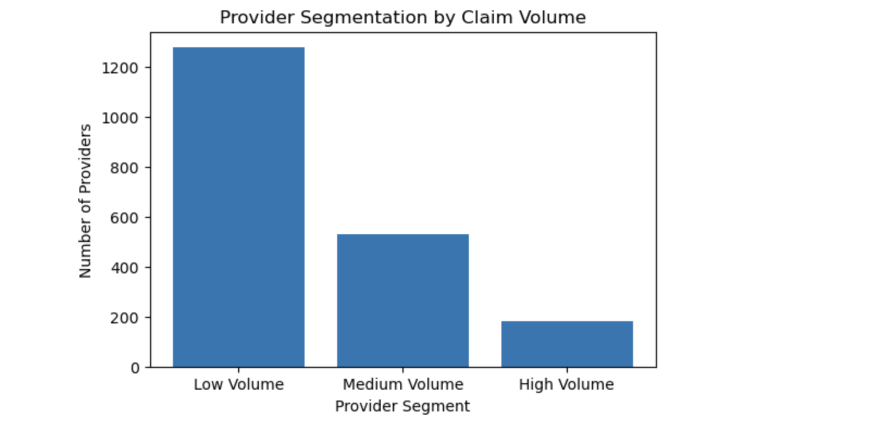

# Healthcare Claims Analytics – Syntegra Medicare CCLF

Analyzed Medicare claims using Python, Excel, and Tableau to compare CVM vs Non-CVM utilization patterns and highlight healthcare cost and efficiency trends.

## 📁 Project Link
➡️ [View Full Report (HTML)](MidTerm_Project_Final_RohiniMallikarjunaiah-3%20(1).html)

---

## 🧠 What I Did
- Cleaned and analyzed Syntegra Medicare CCLF claims data
- Compared **CVM (Cardiovascular/Metabolic)** vs **Non-CVM** utilization patterns  
- Segmented providers by claim types, costs, and patient visits
- Created Tableau dashboards for utilization and cost insights

---

## 🧰 Tools Used
- **Python:** pandas, numpy, matplotlib  
- **Excel:** data preprocessing and summary tables  
- **Tableau:** interactive dashboards and story visualization

---

## 📈 Key Learnings
- Gained deep understanding of **healthcare claim structures** and **CVM disease grouping**
- Strengthened data cleaning, feature engineering, and visualization skills
- Learned how to use multi-source data (Excel + Python + Tableau) for real-world healthcare analytics

---

## 🏁 Key Outcomes
- Found that CVM claims had **higher utilization** but **lower cost per patient**
- Improved data workflow efficiency through automated aggregation in Python
- Developed interactive Tableau dashboards showcasing claim-level insights

---

## 📸 Dashboard Preview

These visuals highlight utilization and cost comparisons between **CVM and Non-CVM** claims, along with provider segmentation and claim frequency insights.
 
Example:  
The Tableau dashboard provided a clear visual comparison between CVM and Non-CVM claims across key metrics — utilization rate, average claim cost, and provider type. Interactive filters allowed stakeholders to explore patterns by region, disease category, and patient demographics, revealing that CVM claims had higher visit frequencies but more efficient cost utilization per patient. These insights helped translate complex healthcare data into actionable business intelligence for policy and cost-optimization decisions.

---

## 🧾 Files
| File | Description |
|------|--------------|
| `MidTerm_Project_Final_RohiniMallikarjunaiah-3 (1).html` | Final analysis report |
| `/data/` | Sample data (if shared) |
| `/reports/` | Tableau screenshots and summary PDFs |
| `README.md` | Project documentation |

